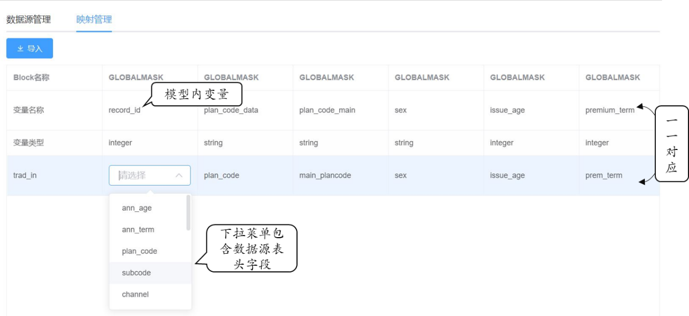

在精算评估模型中，所用的数据源主要来自于公司核心系统。数据源文件中需要包含评估所需要的全部基本信息，如被保险人信息，投保人信息，保费信息，保额信息等。这些数据一般被称为模型点数据。

-   数据源管理

    数据源文件一般可以从核心系统导出，存储为CSV格式，便于导入模型。为了便于在模型外进行管理，可以将数据源文件存放于评估模型所在地址下的“data”文件夹内。

    模型内【数据】界面的“数据源管理”可以管理当前模型内所有可用的数据源文件，包括导入和删除文件。

    模型中可以同时存储多个数据源文件。

   

-   映射管理

    在模型中，有一部分变量的赋值来源于数据源文件。通过模型的映射管理功能可以建立起数据源文件中的字段与模型中变量之间的一一映射关系。通过映射管理，将数据源文件中非标准的数据字段名称转化为模型中可识别的标准变量。

    通过选择每个变量名称下对应的数据源文件中的表头字段，自动将文件中的模型点数值输入相应变量中。

